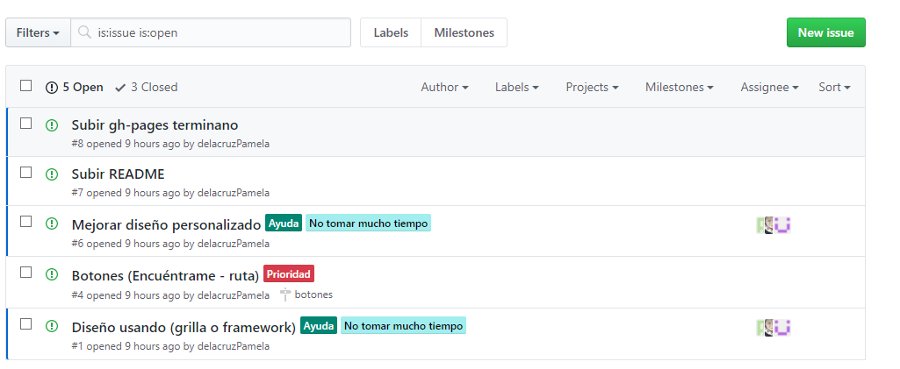
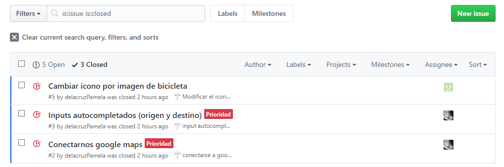
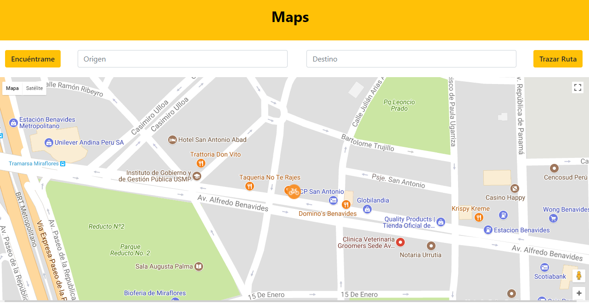

# Proyecto Easey Vreco

[](http://forthebadge.com)
[](http://forthebadge.com)
[](http://forthebadge.com)
[](http://forthebadge.com)
[](http://forthebadge.com)
[](http://forthebadge.com)
[](http://forthebadge.com)

## Objetivo
  Implementar una búsqueda de tu localización haciendo uso de la API de Geolocalización y API Google Maps, así mismo poder trazar una ruta entre dos distancias.
  
## **Herramientas Tecnológicas**
* HTML 5

  * CSS 3

  * Framework Bootstrap

  * Javascript

  * Babel

  * Node.js

  * Guía de Estilos(`.eslintrc`)

## **Getting Started**

### **Estructura de Carpetas**

  ```bash
  Proyecto
  ├── public/
  │   ├── assets/
  │   │   ├── images/
  │   │   ├── // Imágenes
  │   │
  │   ├── css/
  │   │   ├── main.css
  │   │
  │   ├── js/
  │   │   ├── app.js(ES5)
  │   │   └── index.js(ES5)
  │   │
  │   ├── index.html
  │   │
  │   └── vendors/
  │       ├── jquery
  │       │   ├── jquery-3.2.1.min.js
  │       │
  │       ├── materialize││framework de tu elección
  │
  ├── src/
  │   ├── app.js(ES6)
  │   ├── index.js(ES6)
  │
  ├── README.md
  │
  ├── .gitignore
  │
  ├── package.json
  │
  └── .eslintrc

  ```
## **Flujo de trabajo**

  1. Se hizo una nueva organización en Github, haciendo así un solo repositorio estando como contribuidoras todas las personas del grupo.

  2. Se desarrolló la página web a la cual determina la ubicación actual además de trazar rutas con distancias indicadas.

  3. Carga tu localización detectada.

  4. Tenemos dos botones: Encuéntrame y Trazar ruta
  
    - El botón Encuéntrame, devuelve tu localización en ese momento.
    - El botón Trazar ruta, devuelve la ruta buscada con dos direcciones previamente indicadas.

  5. Contenedor en el cual se muestra el mapa.

  6. - Actualización del archivo README.md.

## **Planificación**

  1. Día 07:

- Flujo de la mañana:
  * Se planteó la organización de colaboración en un mismo repositorio.
  * Se repartió puntos de funcionalidad a todas las integrantes.
  * Se agregaron issues con sus respectivos milestones.

- Flujo de la tarde: 
  * Realización de las funcionalidades: autocompletado de inputs, funcionalidad de botones Encuéntrame y Trazar ruta.
  * Implementación de los estilos para la página.
  * Implementación de Babel.
  * Actualización del archivo README.md.

- Encargadas: Araceli, Pamela y Lesly.
- Resultado: Se completó con la página.

## **Anexos**
  

  

### **Scketch**

  

## **Prototipado**

  

## **Resultado Final**

  
# fare-estimate
